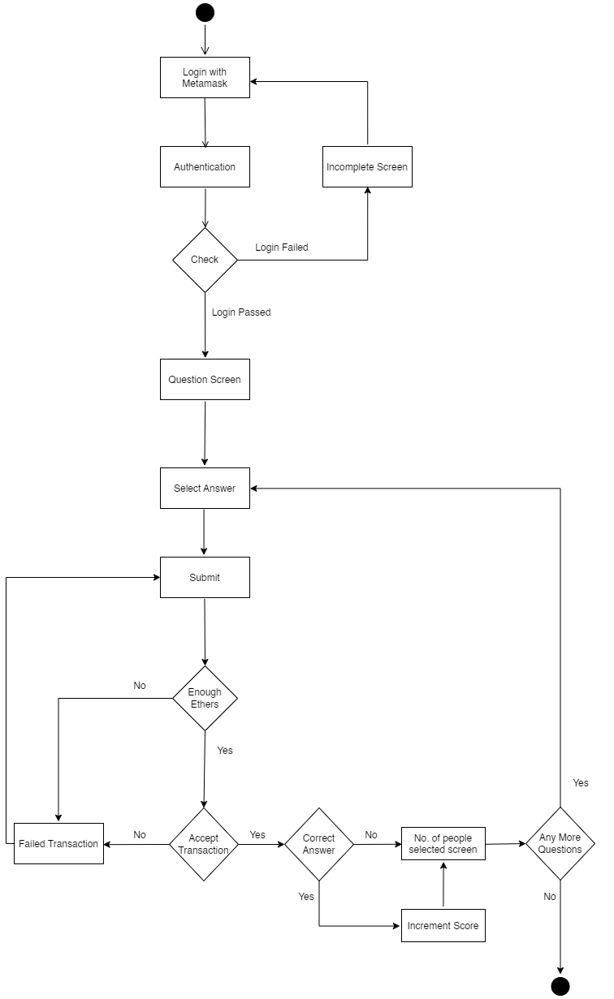

# Blockchain-Quiz-Website
This is a blockchain quiz website made by using HTML, JS, CSS and Blockchain technologies such as Solidity and Truffle.

## This Readme Contains
* [Introduction](#introduction)
* [Technologies used](#technologies-used)
* [Steps to Run](#steps-to-run)
* [Activity Diagram](#activity-diagram)
* [Screenshots](#screenshots)
* [References](#references)

## Introduction
The ability to take the quiz anytime and anywhere is provided by our quiz application. The user doesn't have to wait for the result since it's displayed once he/she answers one question thus time is saved. All users/students get the correct answer after he/she has answered. We have created a blockchain-based solution that enables students to complete online quiz without worrying about their privacy or security. HTML and CSS are used to construct user interfaces, and JavaScript and Solidity are used to execute and deploy smart contracts. The user can see how many have chosen which answer without knowing who chose what. Once the user answers a question, he/she cannot answer it again. The score of correct answers is displayed at the end. 

## Technologies Used: 
- NodeJs 
- Solidity
- Truffle
- HTML
- CSS
- Javascript 
- Ganache (For testing ethers)
- Metamask

## Steps to Run
* We first install all the prerequisites ie. NodeJs, Solidity, Metamask, Truffle
* Open ganache. It gives us ten accounts for development purposes. 
* Connect Metamask to Ganache and import account in metamask from ganache.
* In the terminal type 'truffle migrate --reset'
* Then type 'npm run dev' to run it
* Check metamask and see whether the account is connected to the website. If not, connect it

## Activity Diagram

## Screenshots

## References
* <a href='https://youtu.be/3681ZYbDSSk'>https://youtu.be/3681ZYbDSSk</a>
* <a href='https://ethereum.stackexchange.com/questions/66202/undefined-results-for-web3-eth-accounts-in-truffle-console'>https://ethereum.stackexchange.com/questions/66202/undefined-results-for-web3-eth-accounts-in-truffle-console</a>